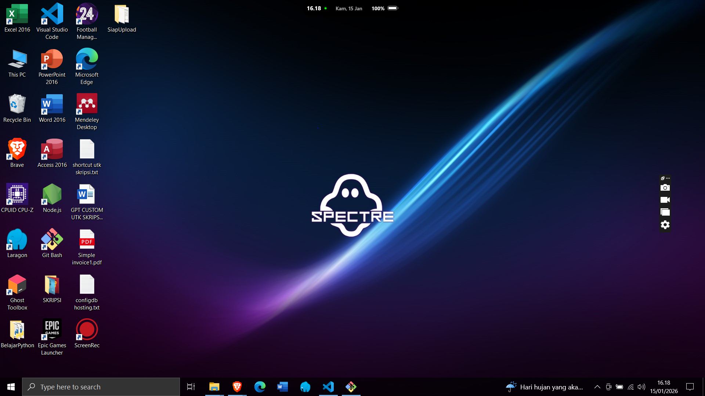
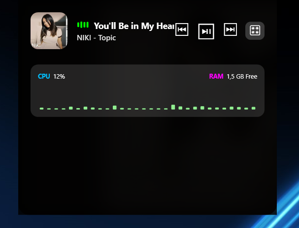
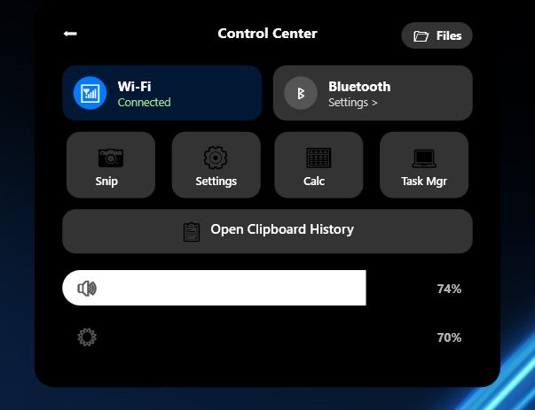
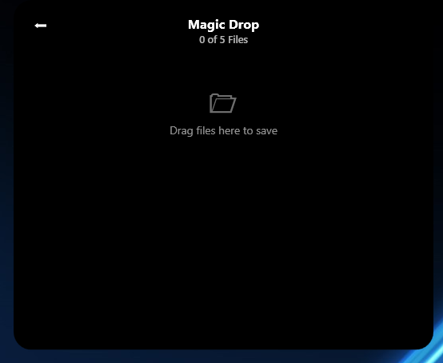

# 🏝️ MyNotch: Dynamic Island for Windows

**MyNotch** adalah aplikasi utilitas desktop yang membawa pengalaman antarmuka _Dynamic Island_ ke ekosistem Windows. Aplikasi ini dirancang untuk meningkatkan produktivitas dengan mengurangi ketergantungan pada _Alt+Tab_ dan menyediakan akses cepat ke fitur sistem.

Dibangun menggunakan **C# (WPF) & .NET 8**, MyNotch menggabungkan estetika modern dengan fungsionalitas tingkat sistem.

---

## ✨ Fitur Unggulan

### 1. Interactive Music Player & System Monitor

Menggabungkan hiburan dan pemantauan performa dalam satu tampilan ringkas.

- **Visualizer:** Grafik batang yang bergerak mengikuti irama musik (menggunakan `NAudio`).
- **System Stats:** Pantau **CPU Load** dan **RAM Usage** secara real-time dengan grafik berwarna ala _hacker_.
- **Ambient Glow:** Background notch menyesuaikan warna album art lagu.

### 2. Control Center & Shortcuts

Pusat kontrol cepat tanpa perlu masuk ke Settings yang dalam.

- **Quick Toggles:** Wi-Fi & Bluetooth.
- **Smart Sliders:** Volume & Brightness (Support Scroll Mouse & Klik Kanan).
- **App Shortcuts:** Akses instan ke Snipping Tool, Task Manager, Calculator, dan Settings.

### 3. Smart Clipboard History 📋

Fitur produktivitas untuk menyimpan riwayat copy-paste.

- **Auto-Save:** Menyimpan teks yang dicopy secara otomatis.
- **Pin (📌):** Tandai teks penting agar tidak hilang/tertimpa.
- **Delete (❌):** Hapus item yang tidak diinginkan.
- **Click-to-Copy:** Klik item untuk menyalin kembali.

### 4. Magic Drop Zone 📂

Drag & drop file ke notch untuk menyimpannya sementara. Solusi cepat untuk memindahkan file antar folder tanpa membuka banyak jendela Explorer.

### 5. Idle Mode (Dynamic Status Bar)

Saat tidak digunakan, notch mengecil menjadi status bar estetik yang menampilkan:

- Jam & Tanggal Real-time.
- Indikator Baterai Kapsul.
- Privacy Dot (Indikator hijau ala iOS).

---

## 🛠️ Tech Stack

- **Framework:** .NET 8 (WPF - Windows Presentation Foundation)
- **Language:** C#
- **Libraries:**
  - `NAudio` (Audio Visualization & Session API)
  - `System.Management` (WMI untuk info Baterai & Brightness)
  - `System.Diagnostics` (Performance Counters untuk CPU/RAM)
- **Concept:** MVVM (Model-View-ViewModel) Architecture.

---

## 📥 Cara Download & Install

Aplikasi ini bersifat **Portable (Self-Contained)**. Tidak perlu install .NET Runtime secara terpisah.

1.  Buka tab [**Releases**](../../releases) di repository ini.
2.  Download file terbaru: **`MyNotchApp-v1.0-Portable.zip`**.
3.  Ekstrak file ZIP tersebut.
4.  Jalankan **`MyNotchApp.exe`**.

> **Note:** Jika muncul peringatan _Windows SmartScreen_, klik _More Info_ -> _Run Anyway_ (karena aplikasi ini adalah open-source project yang belum memiliki sertifikat digital berbayar).

---

## ⚠️ Disclaimer

Aplikasi ini dibuat sebagai proyek portofolio (_Pet Project_) untuk mengatasi keresahan pribadi terhadap manajemen _multitasking_ di Windows.

- **Developer:** [Zarmaull]
- **License:** MIT License.

---

_If you find this project useful, give it a star! ⭐_
